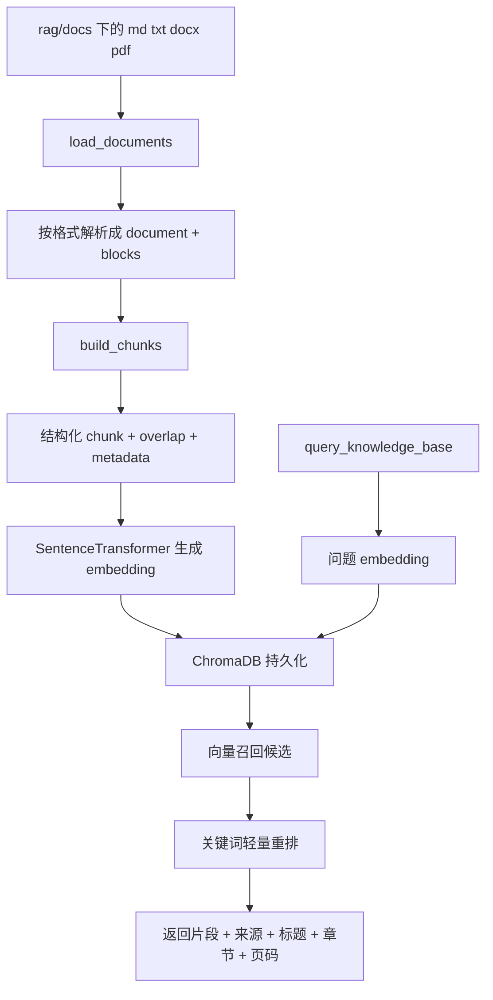
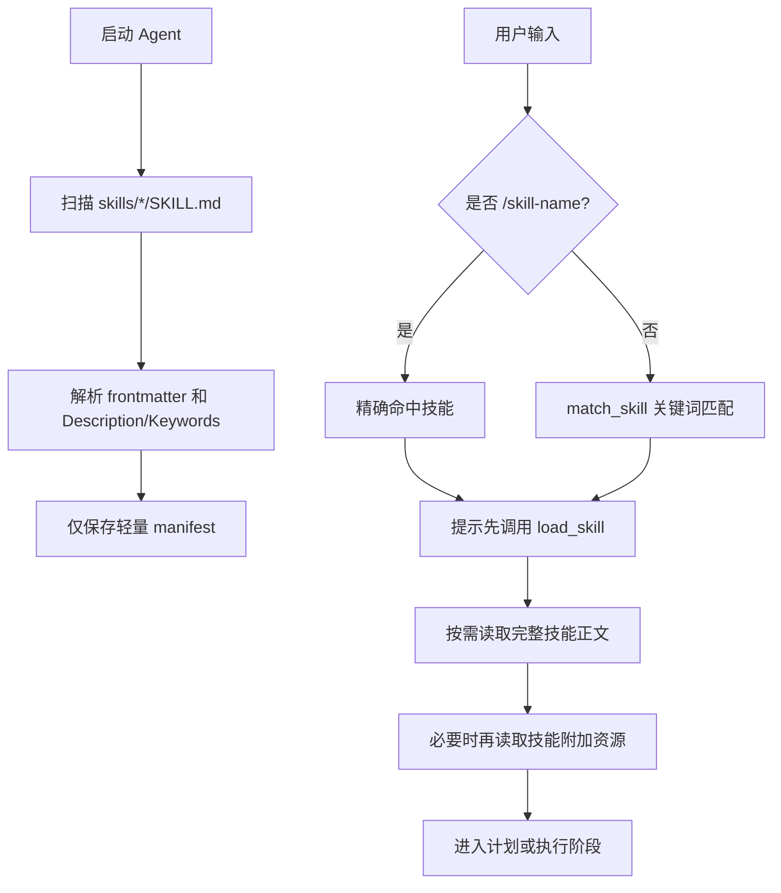
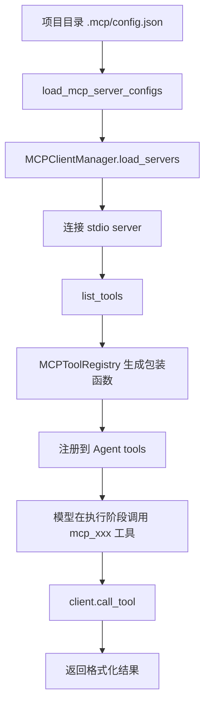
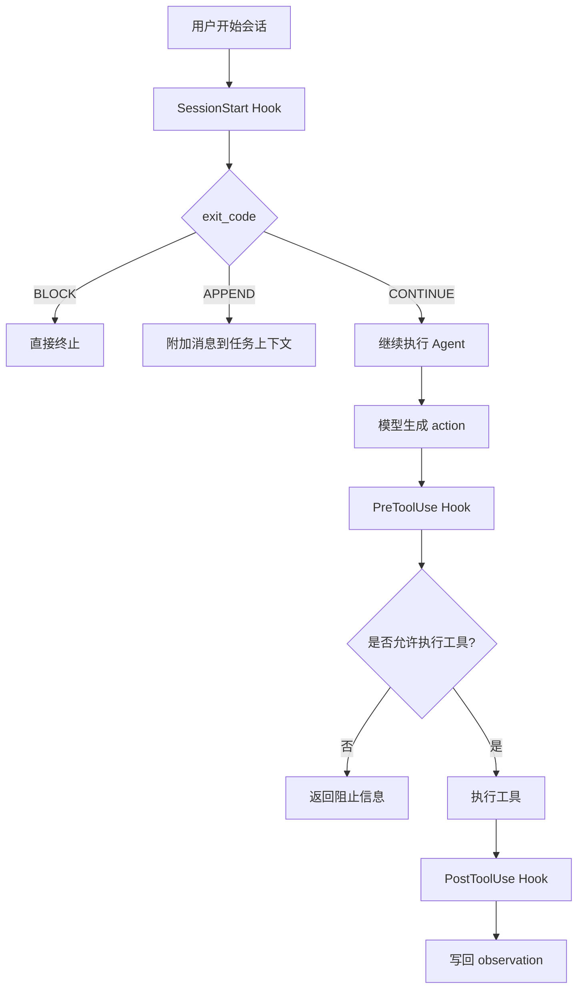

# Python ReAct Agent 自动化助手

## 项目简介

这是一个以 **CLI 为主** 的手写智能 Agent 项目，当前核心能力已经覆盖：

- **Plan-and-Execute + ReAct 主循环**
- **子智能体 / 多智能体协作**
- **Skills 技能系统**
- **本地 RAG 知识库（支持 `md / txt / docx / pdf`）**
- **MCP Server 工具接入**
- **Hook 事件机制**
- **会话记忆与长期记忆**

项目的目标不是做一个“单轮聊天壳”，而是做一个可执行任务、可扩展、可编排的 Agent 框架。

## 当前功能总览

### 1. Agent 主循环能力

- **通用问答直答路径**
  - 对纯概念型问题，Agent 会跳过任务规划，直接走回答路径。

- **Plan-and-Execute 路径**
  - 先调用模型生成 `<step>` 计划。
  - 用户确认后，逐步执行每个步骤。

- **ReAct 执行路径**
  - 每个步骤内部通过 `<thought> / <action> / <observation>` 小循环完成。

- **失败恢复**
  - 同一工具连续失败时，会触发恢复逻辑，避免无意义重试。

- **历史压缩与会话上下文**
  - 自动注入最近的会话历史。
  - 超过阈值时压缩消息，降低上下文溢出风险。

### 2. 子智能体与多智能体能力

- **子智能体 `task()`**
  - 在独立上下文中执行子任务，不污染父上下文。

- **队友管理**
  - 支持创建队友、列出队友、查看收件箱、广播、发送定向消息。

- **计划审批 / 优雅下线**
  - 队友可提交计划审批请求。
  - 领导可发起 shutdown request，队友可批准或拒绝。

- **团队状态命令**
  - `/status`
  - `/team`
  - `/inbox [name]`

### 3. Skills 技能系统

- **技能发现**
  - 启动时扫描 `skills/*/SKILL.md`。

- **两种触发方式**
  - Slash 命令：`/analyze-code`
  - 关键词匹配：例如“帮我分析代码质量”

- **按需加载**
  - 先只加载轻量 manifest。
  - 真正执行时再 `load_skill()` 读取完整技能正文。

- **附加资源延迟读取**
  - 技能目录内的参考资料不会一上来全部注入提示词。

当前内置技能目录：

- `analyze-code`
- `list-files`
- `write-tests`

### 4. RAG 知识库能力

- **支持文档格式**
  - `md`
  - `txt`
  - `docx`
  - 文本型 `pdf`

- **结构化解析**
  - 提取标题、段落、章节路径、页码。
  - 先形成 `block`，再组合成 `chunk`。

- **结构化分块**
  - 尽量不跨章节切块。
  - 支持 chunk overlap。
  - 超长段优先做句子级语义切分，再退回字符滑窗切分。

- **索引构建**
  - 使用 `SentenceTransformer("all-MiniLM-L6-v2")` 生成 embedding。
  - 使用 ChromaDB 持久化向量库。

- **查询增强**
  - 先做向量召回。
  - 再做轻量关键词重排。
  - 查询结果带上更丰富的 metadata：
    - 来源文件
    - 相对路径
    - 文件类型
    - 标题
    - 章节路径
    - chunk 序号
    - PDF 页码范围

### 5. MCP 能力

- **支持从 `.mcp/config.json` 读取 MCP server 配置**
- **当前仅支持 `stdio` transport**
- **启动时自动连接 server 并加载 tools**
- **自动把 MCP tool 包装成 Agent 可调用工具**
- **`/status` 可查看 MCP server 连接状态**

### 6. Hook 能力

- **SessionStart**
  - 在会话开始前运行

- **PreToolUse**
  - 工具执行前运行
  - 当前默认会拦截空的终端命令

- **PostToolUse**
  - 工具执行后运行
  - 当前默认记录工具调用日志

### 7. 内置工具能力

基础工具：

- `read_file`
- `write_to_file`
- `run_terminal_command`
- `list_directory`
- `search_in_files`
- `web_search`
- `query_knowledge_base`

Agent 扩展工具：

- `load_skill`
- `save_memory`
- `task`
- `spawn_teammate`
- `list_teammates`
- `send_message`
- `broadcast_message`
- `read_team_inbox`
- `get_status`
- `request_shutdown`
- `review_plan`
- 动态 MCP tools（如果已连接 MCP server）

## 项目结构

```text
.
├── agent.py                 # ReActAgent、子智能体、CLI 入口
├── team.py                  # 多智能体消息总线与队友线程管理
├── tools.py                 # 基础工具与知识库查询
├── skills.py                # 技能注册、匹配、按需加载
├── hooks.py                 # HookRunner 与默认 Hook
├── memory.py                # 长期记忆存储
├── prompt_template.py       # Plan / ReAct / Subagent / Direct Answer 提示词模板
├── internal_mcp/
│   ├── client.py            # MCP client 管理与 tool 调用
│   ├── config.py            # .mcp/config.json 解析
│   └── registry.py          # MCP tool 包装与注册
├── skills/
│   ├── analyze-code/
│   ├── list-files/
│   └── write-tests/
├── rag/
│   ├── build_index.py       # 索引构建入口
│   ├── document_pipeline.py # 文档解析、block/chunk 构建
│   ├── docs/                # 知识库原始文档
│   └── chroma_db/           # Chroma 持久化目录
└── README.md
```

## 运行环境

- Python `>=3.11`
- [uv](https://github.com/astral-sh/uv)
- Google Gemini API Key，或本地 [Ollama](https://ollama.com)

核心依赖：

- `google-genai`
- `chromadb`
- `sentence-transformers`
- `python-docx`
- `pypdf`
- `mcp`
- `ddgs`

## 安装

```bash
uv sync
```

## 环境变量

在项目根目录创建 `.env`：

```env
GOOGLE_API_KEY=your_google_api_key_here
HTTPS_PROXY=http://127.0.0.1:7890
HTTP_PROXY=http://127.0.0.1:7890
```

说明：

- 使用 `gemini-*` 模型时需要 `GOOGLE_API_KEY`
- 使用 Ollama 本地模型时不需要 Google API Key

## 快速开始

### 1. 启动 Agent

使用 Gemini：

```bash
uv run python agent.py .
```

使用 Ollama：

```bash
ollama pull qwen2.5:3b
uv run python agent.py . --model qwen2.5:3b
```

查看帮助：

```bash
uv run python agent.py --help
```

### 2. 构建知识库索引

先把知识库文档放到 `rag/docs/`，然后运行：

```bash
uv run python rag/build_index.py
```

支持格式：

- `.md`
- `.txt`
- `.docx`
- `.pdf`

### 3. 常见交互方式

Slash 技能：

```text
/analyze-code
/list-files
/write-tests
```

团队状态命令：

```text
/status
/team
/inbox
/inbox alice
```

自然语言示例：

```text
请帮我分析这个仓库的代码结构
请用多 agent 模式处理这个任务，并创建 researcher/coder/tester 队友
帮我查询知识库里关于 LangChain Chains 的内容
```

## 6 类核心流程图

### 1. Agent Loop

```mermaid
flowchart TD
    A[用户输入] --> B[加载 memory section]
    B --> C[运行 SessionStart Hook]
    C --> D{是否特殊命令?}
    D -->|是| E[/status /team /inbox]
    D -->|否| F{是否 slash skill / 关键词命中?}
    F -->|是| G[生成 skill hint 或 load_skill 提示]
    F -->|否| H[直接进入任务决策]
    G --> H
    H --> I{是否通用问答?}
    I -->|是| J[Direct Answer]
    I -->|否| K[Plan 阶段生成 step 列表]
    K --> L{规划成功?}
    L -->|否| M[降级为纯 ReAct Loop]
    L -->|是| N[用户确认计划]
    N --> O[逐步执行 execute_step]
    O --> P[汇总所有 step 结果]
    P --> Q[输出 final_answer]
    J --> Q
    M --> Q
```

### 2. Multi-Agent

```mermaid
flowchart TD
    A[主智能体] --> B[spawn_teammate]
    B --> C[TeammateManager 创建线程]
    C --> D[队友独立 ReAct Loop]
    D --> E[build_teammate_tools]
    E --> F[读取 inbox / 执行工具 / 发送消息]
    F --> G{是否完成任务?}
    G -->|否| D
    G -->|是| H[send_message 或 task_result 回传 lead]
    A --> I[/team / /status / /inbox]
    A --> J[request_shutdown / review_plan]
    J --> C
```

### 3. RAG



### 4. Skills



### 5. MCP



### 6. Hook



## 各模块说明

### Agent Loop

`agent.py` 中的 `ReActAgent.run()` 是总入口，当前主流程大致分为三条：

- **特殊命令路径**
  - `/status`
  - `/team`
  - `/inbox [name]`

- **通用问答路径**
  - 识别为概念问答后，直接调用 `_direct_answer()`
  - 默认只暴露 `web_search` 和 `query_knowledge_base`

- **任务执行路径**
  - 先规划
  - 再逐步执行
  - 最后汇总

### Multi-Agent

当前多智能体分为两层：

- **轻量子智能体**
  - `task(prompt)`
  - 用于派生一个独立上下文的小代理执行子任务

- **队友线程模型**
  - 由 `team.py` 中的 `TeammateManager` 管理
  - 基于 `MessageBus` 的 inbox 文件通信
  - 适合更持久的 team-style 协作

### RAG

当前 RAG 的核心文件：

- `rag/document_pipeline.py`
- `rag/build_index.py`
- `tools.py::query_knowledge_base`

当前分块参数：

- `CHUNK_SIZE = 500`
- `CHUNK_OVERLAP = 50`

当前 chunking 逻辑：

- 尽量保持同一 chunk 不跨章节
- 普通情况按 block 组合 chunk
- 超长段优先按句子/换行做语义切分
- 仍不够时退回字符滑窗切分

### Skills

技能系统当前是“**轻量发现 + 按需加载**”模式：

- 启动时只读取 manifest
- 真正执行时再加载完整技能正文
- 技能附加资源只暴露路径，不一次性全部注入上下文

### MCP

当前 MCP 配置文件位置：

```text
.mcp/config.json
```

当前配置要求：

- `servers` 必须是数组
- 当前只支持 `stdio`
- `command` 必填
- `args` 必须是字符串数组
- `env` 必须是字符串字典

一个最小示例：

```json
{
  "servers": [
    {
      "name": "example",
      "transport": "stdio",
      "command": "python",
      "args": ["path/to/server.py"],
      "enabled": true
    }
  ]
}
```

### Hook

默认 Hook 在 `hooks.py` 中注册：

- `SessionStart`
- `PreToolUse`
- `PostToolUse`

默认行为：

- 会话开始时打印 `SessionStart`
- 工具执行前校验空终端命令
- 工具执行后打印 `PostToolUse`

## 扩展方式

### 添加新工具

1. 在 `tools.py` 中定义函数并写清 docstring
2. 在 `agent.py` 的 `main()` 中加入基础工具列表，或在 `ReActAgent.__init__()` 中注册为方法工具
3. 启动后工具会自动出现在提示词工具列表中

### 添加新技能

在 `skills/<skill-name>/SKILL.md` 中编写技能文件，推荐包含：

- frontmatter（可选）
- `# 标题`
- `## Description`
- `## Keywords`
- `## Steps`

技能会在下次启动时自动发现。

### 添加新 Hook

1. 在 `hooks.py` 中实现一个 handler
2. 返回 `HookResult` 或字典
3. 在 `build_default_hook_runner()` 中注册事件

### 添加新 MCP Server

1. 在项目根目录创建或修改 `.mcp/config.json`
2. 配置好 `command`、`args`、`env`
3. 重启 Agent
4. 用 `/status` 查看 MCP server 是否成功连接

## 使用建议

- **概念型问题**：适合直接问，Agent 会倾向走直答路径
- **项目分析 / 改代码**：适合走 Plan-and-Execute + ReAct
- **复杂任务拆分**：显式要求使用 multi-agent
- **固定类型任务**：优先用 Skills
- **知识问答**：先构建 RAG 索引，再用 `query_knowledge_base`
- **外部工具生态接入**：优先通过 MCP

## 注意事项

1. 使用 Gemini 时请确保 `.env` 和代理配置可用
2. `run_terminal_command` 属于高风险工具，执行前务必确认命令内容
3. 构建 RAG 前请先把文档放进 `rag/docs/`
4. PDF 支持基于文本提取，对扫描版图片 PDF 不保证效果
5. 当前 MCP 仅支持 `stdio` transport

## 致谢

- [MarkTechStation/VideoCode](https://github.com/MarkTechStation/VideoCode)
- Google Gemini API
- Ollama
- ChromaDB
- sentence-transformers

## 许可证

本项目基于 MIT License 开源。
